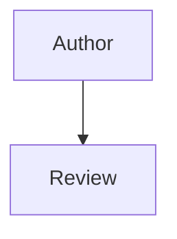

# Contributing

Note: update the contents of this template file to reflect the projects methods and processes.

Thank you for helping produce documentation for Health New Zealand's Digital Services.

See the [HNZ Engineering Standards](https://engineering-standards.digital.health.nz) for an example site using this tool stack.

## The stack

The site is built directly from this repository using [MkDocs](https://www.mkdocs.org/) and [Material for MkDocs](https://squidfunk.github.io/mkdocs-material/).

These tools will take raw markdown files and build a themed website from them. For repos hosted on Gitlab or Github, CI pipelines will publish any changes that are merged to the default git branch.

See the [START-HERE.md](START-HERE.md) for instructions on how to set up a local development environment or bootstrap the initial project.

## Adding or Changing a Page

Create or update a Markdown file in the relevant category under the `docs` folder. Subfolders can also added under `docs` for further organising content.

### Markdown

For more details, visit the [markdown reference](https://www.markdownguide.org/basic-syntax/).

## Page metadata

Optionally add page metadata to the top of each new or changed page. An example is a `last_edited` date shown in the page footer:

	```yaml
	---
	last_edited: YYYY-MM-DD
	---
	```

See the upstream docs for Mkdocs and the Material theme for more metadata options.

## Navigation menu

By default, the site will have an automatically populated navigation menu based on the contents of the `docs` folder. If you want more control over the structure of the menu eg custom titles, custom page order, or even just leaving out some draft pages - uncomment and edit the example `nav:` section of `mkdocs.yml`.

Note: disabling the automatic navigation and configuring a custom nav section will mean all pages need to be manually added to `mkdocs.yml`

## Mermaid Diagrams

For creating certain types of diagrams in your pages, you can embed native Mermaid definitions in the markdown like this:

~~~text

~~~

See the [Mermaid](https://mermaid.ai/open-source/intro/) website for more examples. Mermaid diagrams will pop into a lightbox when clicked on.
