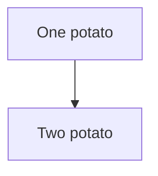

Welcome to your new documentation site.



## Tools

- [MkDocs](https://www.mkdocs.org/) for building a static site from markdown.
- [Material for MkDocs](https://squidfunk.github.io/mkdocs-material/) theme for mkdocs that has been customised to for HNZ in this project template.

## Markdown 

- [markdown reference](https://www.markdownguide.org/basic-syntax/)

## Mermaid Check

You should see a diagram rendered below. If not, some extras haven't been installed properly.

