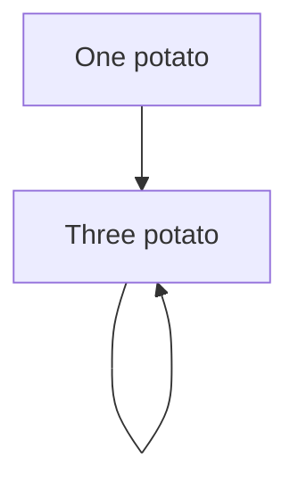



## Purpose

Purpose here.... 

## Audience

Audience here

## Adoption expectations

Audience here

## Key contacts, questions or feedback
- **Digital Health Strategy and Design**
- Rosie Percival, Senior UX Design
- Duncan Gibb, Lead Service Design

## Tools

- [MkDocs](https://www.mkdocs.org/) for building a static site from markdown.
- [Material for MkDocs](https://squidfunk.github.io/mkdocs-material/) theme for mkdocs that has been customised to for HNZ in this project template.

## Markdown 

- [markdown reference](https://www.markdownguide.org/basic-syntax/)

## new section

## Mermaid Check

You should see a diagram rendered below. If not, some extras haven't been installed properly.

```mermaid
flowchart TD
	A[One potato] --> B[Two potato] --> B[Three potato]
```
